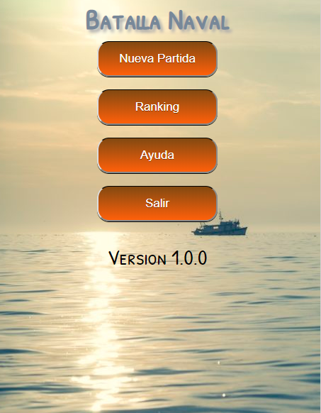
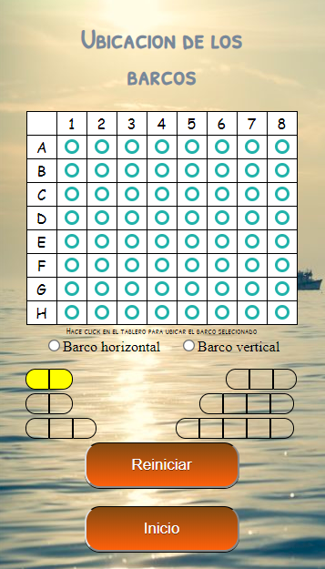

# Batalla Naval

_El juego de la batalla naval. Actualmente se encuentra en desarrollo._

## Disponible en version web y mobile 🚀

_Diseño responsivo y sencillo._

 

### Pre-requisitos 📋

_Para la versión web unicamente necesitas tener instalado un navegador (Obviamente) :)_

## Tecnologias que usé 🔧

* Phonegap
* HTML5
* CSS3
* Javascript
* Imagenes open source

## Autora ✒️

_Idea, desarrollo, documentación._

* **Luján Rojas** - [Email](lujanrojas.informatica@gmail.com)

## Extra: Sobre mi y la idea del desarrollo de la app 📌

_Siempre me gustó el juego de la batalla naval, me gustaba armar los tableros en papel, un día se me ocurrió desarrollar una app que me permita jugar directamente. Por ahora solo se puede jugar contra la computadora. Mi idea a futuro sería que se pueda jugar de a dos personas. Actualmente el juego funciona, sin embargo más adelante cuando tenga tiempo me gustaría mejorarla. Si queres aportar o usar mi código como referencia bienvenido sea. Pido disculpas si el código está desordenado, la idea salió y escribí el codigo en dos semanas. De vez en cuando subo alguna que otra modificación, pero como les dije anteriormente, es una versión beta que tiene mucho para mejorar :)_ 

---
Hecho con mucho ❤️. Saludos! Lushan. 😊

